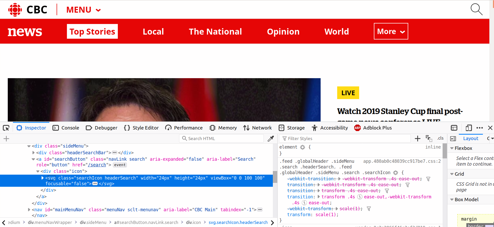
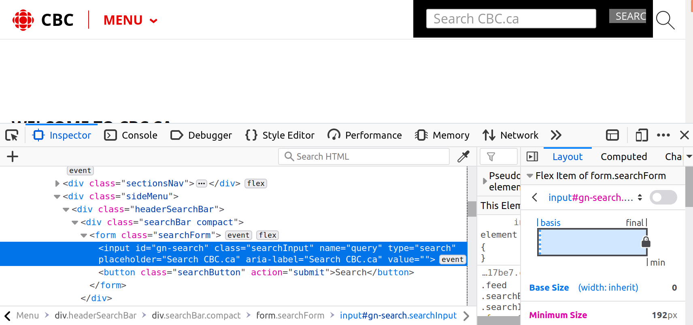
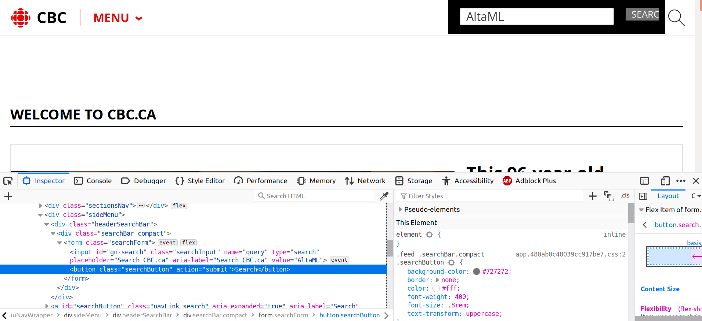
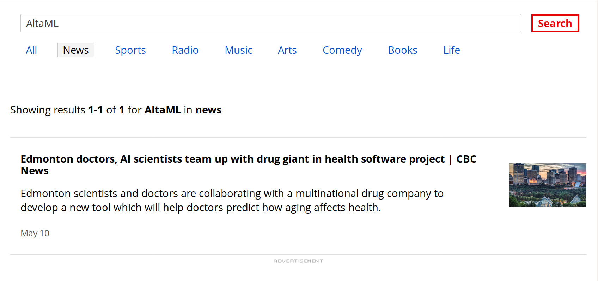
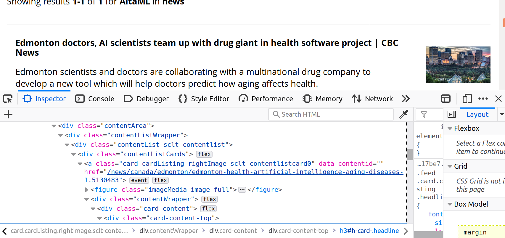

# **Browsing the Web Programmatically: Pointing-and-Clicking on the Web with Selenium**

**Author:** Reuben S. Gazer (AltaML)  
**Date Started:** June 11, 2019

**In this notebook, we will learn how to:**  

- **click buttons on webpages programmatically** (without opening a browser yourself and clicking manually)
- **submit text to search boxes on webpages** (like Google Search, Wikipedia, Twitter, etc.)
- **scrape web data from some resulting page** (although you can learn this in the simple-weather-webscrape-walkthrough)

all using the **selenium** python package (specifically built for web-browser automation).

****

In the simple-webscrape-example-walkthrough, we directly pulled HTML content from webpages off of the Weather Network website.  
We were lucky enough that the website URL structure for the forecast of a given city was quite simple.  

For Edmonton, the URL was:

www.theweathernetwork.com/ca/weather/alberta/edmonton

For Calgary, the URL would be:

www.theweathernetwork.com/ca/weather/alberta/calgary

There are times when the URL for something of this nature is not so easy to predict in advance, and you may need to do some clicking and/or searching from some starting URL.  

**Motivation of our Example Walkthrough**

I needed to retrieve information about the hours of operation of ~200 Fountain Tire branches for a deep dive. For reasons related to inconsistencies in returned HTML documents and problems scraping from the Google Search page (they want you to use their API), I had to do some retrieval through the Fountain Tire website.  

To retrieve the hours of operation for a Fountain Tire branch via their website, I needed to:  

- open up the Fountain Tire website
- go to the Store Locator
- search a specific branch by its address in a search box and click "submit" 
- click the top result returned on the following page to select it
- click another button to expand the CSS element showing the hours of operation

...for a few hundred Fountain Tire branches! Surely this could be automated. Using _selenium_ we can click around, submit text into boxes, expand page elements, as well as do regular scraping of content once we've arrived at the desired page.

**In this example, we will do a similar procedure on the CBC news website.**  

### **Example Walkthrough: Scraping the Content of a News Article from CBC**

**Goal**: Retrieve the content of a news article about AltaML from the CBC website.

First, import the web-driver from the selenium package.


```python
from selenium import webdriver
```

Initiate the homepage URL from which we will be searching for AltaML-related articles.


```python
url = 'https://www.cbc.ca/news'
```

Go visit this site manually in another browser tab, and look at the homepage.  
In the upper right corner there is a search-button that looks like a magnifying glass.  
If you click this, a search bar opens up in which we want to type and submit the term 'AltaML'.  
After you type in 'AltaML', you need to press the "Search" button to submit this request.

Let's start the web-driver and perform these actions.  
In the simple-weather-webscrape walkthrough, we suppressed the physical opening of the browser and instead allowed it to be done in the background.  
The source code provided in the _.py_ file will give you that option, but I think it is informative to actually _see_ the browser opening and the actions completed automatically in front of you, so here we will not suppress browser opening.  
Just keep this in mind!


```python
driver = webdriver.Firefox()
```

We should also make the driver wait a few seconds for things to load, to make sure the elements we would like to interact with are actually there:


```python
wait_time = 10 # seconds
driver.implicitly_wait(wait_time)
```

Ask the web-driver to open up the homepage of CBC.


```python
driver.get(url)
```

Now we want to click the magnifying-glass in the upper right corner to open the search box.  
We can do this by _finding an HTML element_, then performing the _click()_ method _on_ that element.  
First we need to identify the element - right click the magnifying glass in your browser and click "Inspect Element" or "Inspect" to open the HTML source code.  

Here is the result of inspecting the magnifying-glass element:



The element we want to click is looks like an _svg_ element with class="searchIcon headerSearch".  

Selenium has a number of options for selecting HTML elements, such as :

driver.find_element_by_xpath()  
driver.find_element_by_css_selector()  
driver.find_element_by_id()  
driver.find_element_by_class_name()
driver.find_element_by_name()

...and so on. Feel free to check these out on your own.

It seems reasonable to retrieve this element by its class name, however if you try to select the _svg_ element with class="searchIcon headerSearch" it will show that this element is not found:


```python
search_element = driver.find_element_by_class_name("searchIcon headerSearch")
```


    ---------------------------------------------------------------------------

    NoSuchElementException                    Traceback (most recent call last)

    <ipython-input-25-e2a1ef5ee3f6> in <module>
    ----> 1 search_element = driver.find_element_by_class_name("searchIcon headerSearch")
    

    /usr/lib/python3/dist-packages/selenium/webdriver/remote/webdriver.py in find_element_by_class_name(self, name)
        486             driver.find_element_by_class_name('foo')
        487         """
    --> 488         return self.find_element(by=By.CLASS_NAME, value=name)
        489 
        490     def find_elements_by_class_name(self, name):


    /usr/lib/python3/dist-packages/selenium/webdriver/remote/webdriver.py in find_element(self, by, value)
        856         return self.execute(Command.FIND_ELEMENT, {
        857             'using': by,
    --> 858             'value': value})['value']
        859 
        860     def find_elements(self, by=By.ID, value=None):


    /usr/lib/python3/dist-packages/selenium/webdriver/remote/webdriver.py in execute(self, driver_command, params)
        309         response = self.command_executor.execute(driver_command, params)
        310         if response:
    --> 311             self.error_handler.check_response(response)
        312             response['value'] = self._unwrap_value(
        313                 response.get('value', None))


    /usr/lib/python3/dist-packages/selenium/webdriver/remote/errorhandler.py in check_response(self, response)
        235         elif exception_class == UnexpectedAlertPresentException and 'alert' in value:
        236             raise exception_class(message, screen, stacktrace, value['alert'].get('text'))
    --> 237         raise exception_class(message, screen, stacktrace)
        238 
        239     def _value_or_default(self, obj, key, default):


    NoSuchElementException: Message: Unable to locate element: .searchIcon headerSearch


I'm not familiar with why this error actually occurs, but often something like this magnifying-glass actually has a few elements layered on top of each other, and it is not actually the _svg_ element we need to click, it is a slightly higher level element in the tree.    
The actual clickable element is a _link_ which opens up the text search box - links are "a" elements in HTML.  
Therefore, let's try to select the "a" element with id="searchButton" just above the _svg_ element.  
Almost always, a search button (eg. Wikipedia follows the same suit) has this id:


```python
search_element = driver.find_element_by_id('searchButton')
```

Now let's click this element with the _.click()_ method:


```python
search_element.click()
```

If you are following along with the browser open, you'll see that the text-search box has appeared!  
Following a similar method, we inspect this element to find:



This _input_ HTML element is what we would like to interact with - specifically, to submit text into this search box element.


```python
search_box = driver.find_element_by_id("gn-search")
```

To submit our search term 'AltaML' into this element, we use the _.send_keys()_ method:


```python
search_string = "AltaML"
search_box.send_keys(search_string)
```

Now that we've submitted the text (you should see this in real-time in your opened browser) we need to click the "SEARCH" button to submit it.  
Find this element by inspection like we've done before:



It is a button element (this is often the case on other websites as well).  
Like before, find this element and click it! This can be done in one step:


```python
driver.find_element_by_class_name("searchButton").click()
```

Fantastic! Your browser should have searched for "AltaML" in the search box, clicked the search button, and returned a page with 1 article on it:



Now, let's click on the article to open it in full. You may know how to do this now - you just need to figure out what element to click!  
**Remember, there are often many elements stacked together that represent something - if it is a link of some sort that leads to another page, look for an _a_ element:**



When I had right-clicked on part of the article's box, it initially highlighted a header element, but it is probably the higher level _a_ element we need to click:


```python
driver.find_element_by_class_name("card cardListing rightImage sclt-contentlistcard0").click()
```


    ---------------------------------------------------------------------------

    NoSuchElementException                    Traceback (most recent call last)

    <ipython-input-22-8b1cc848d3f9> in <module>
    ----> 1 driver.find_element_by_class_name("card cardListing rightImage sclt-contentlistcard0").click()
    

    /usr/lib/python3/dist-packages/selenium/webdriver/remote/webdriver.py in find_element_by_class_name(self, name)
        486             driver.find_element_by_class_name('foo')
        487         """
    --> 488         return self.find_element(by=By.CLASS_NAME, value=name)
        489 
        490     def find_elements_by_class_name(self, name):


    /usr/lib/python3/dist-packages/selenium/webdriver/remote/webdriver.py in find_element(self, by, value)
        856         return self.execute(Command.FIND_ELEMENT, {
        857             'using': by,
    --> 858             'value': value})['value']
        859 
        860     def find_elements(self, by=By.ID, value=None):


    /usr/lib/python3/dist-packages/selenium/webdriver/remote/webdriver.py in execute(self, driver_command, params)
        309         response = self.command_executor.execute(driver_command, params)
        310         if response:
    --> 311             self.error_handler.check_response(response)
        312             response['value'] = self._unwrap_value(
        313                 response.get('value', None))


    /usr/lib/python3/dist-packages/selenium/webdriver/remote/errorhandler.py in check_response(self, response)
        235         elif exception_class == UnexpectedAlertPresentException and 'alert' in value:
        236             raise exception_class(message, screen, stacktrace, value['alert'].get('text'))
    --> 237         raise exception_class(message, screen, stacktrace)
        238 
        239     def _value_or_default(self, obj, key, default):


    NoSuchElementException: Message: Unable to locate element: .card cardListing rightImage sclt-contentlistcard0


Hm, this doesn't seem to work, even though the element is right there! Since it appears I can really click on _any_ part of the returned box, I'll just try another part of this element - the card_content:


```python
driver.find_element_by_class_name("card-content").click()
```

That appears to work, and will open up a the page.  
Sometimes figuring out the elements necessary to click is tedious - but once you've done it once, you can run this script as many times as you'd like.

**Scraping Data from the CBC Article on AltaML**

The way we grab text from HTML elements was shown in the webscraping-walkthrough available in this same repository.  
However, for the sake of completeness, we will do this again here.  

Let us grab:

- the title of the article
- the subtitle of the article
- the date and time this article was posted
- all text content from the article text (insofar as it relates to the real article content - not advertising links in between)

Time for some inspecting! Go ahead and inspect the page by right-clicking the items listed above, and note the elements that they reside in.  
Remember that _selenium_ does not return text from HTML elements (I have no idea why they wouldn't allow this!) as it is meant more for web navigating, not necessarily scraping.  
For the scraping, we will simply ask the page for its HTML contents and re-create the HTML tree using the _lxml_ package.

First, grab the HTML content from the page with selenium:


```python
page_html = driver.page_source
```

Import the lxml package and re-create the HTML tree:


```python
from lxml import html

html = html.fromstring(page_html)
```

Then, we grab all of the elements using either xpath or cssselect (I choose to use xpath here - they both work).  
As a quick reminder, I begin the xpath with two slashes (//) to jump directly to some element, instead of going off of the absolute tree path from the top.  
To select the text from a _div_ element with the class="cool-guy" I would do "//div[@class='cool-guy']/text()":


```python
title = html.xpath("//h1[@class='detailHeadline']/text()")[0] # it returns a list, so I just select the first and only option
subtitle = html.xpath("//h2[@class='deck']/text()")[0]
```

It looks like the actual content of the article is a series of paragraph elements (_p_) stored in a _div_ element with class="story".  
First, I find this _div_ element, then go into the _span_ element just below, then select _p_ elements inside this, and retrieve their text.  
Since there are numerous of these elements that fit the xpath, it returns a list of them:


```python
paragraphs = html.xpath("//div[@class='story']/span/p/text()")
```


```python
paragraphs
```


    ['Edmonton scientists and doctors are collaborating with a multinational drug company to develop a new tool which will help doctors predict how aging affects health.',
     'AltaML, an Edmonton software company developing artificial intelligence, and doctors associated with the Oliver Primary Care Network will work with pharmaceutical giant Boehringer Ingelheim Canada\xa0Ltd. to develop a frailty index which clinicians can use to predict chronic illnesses like diabetes, heart disease and mental health conditions.\xa0',
     '"We\'re now using the latest techniques to try to manage very complicated diseases and we\'re doing some of these things for the first time in Edmonton," said\xa0Reg Joseph, CEO of Health City, an Edmonton non-profit group funded by the city, which is bringing the players together.',
     '"This is very exciting as a community because we have so much strength in artificial intelligence and machine learning and here\'s a great example of one of our companies being able to bridge the gap and actually develop new technologies," Joseph\xa0told CBC News.',
     'Boehringer Ingelheim Canada Ltd.\xa0is investing in new methods of treating that "go beyond the pill,"\xa0Joseph said.',
     'AltaML\xa0CEO\xa0Cory Janssen\xa0said of his team of scientists take\xa0large data and put\xa0it in algorithms and "looking for those correlations, those permutations, those patterns that maybe the human brain can\'t see."',
     '"Machine learning is when we\'re teaching algorithms to adapt without being explicitly programmed."\xa0',
     "Janssen sees Edmonton's\xa0future as combining expertise in AI with health and other industries like oil and gas to help\xa0diversify the economy.",
     '"We literally have this pipeline of data scientists that is second to none," he said. \xa0',
     '"There\'s so many amazing researchers on the health side of things, I think the answers are going to be combining that excellence that we have in health with the excellence in AI and ML."',
     'Mayor Don Iveson foreshadowed the collaboration in his State of the City speech Tuesday at the Edmonton Convention Centre.',
     'Iveson referred directly to AltaML and the collaboration as an example of Edmonton succeeding in diversifying its economy.',
     'The parties are\xa0announcing\xa0the collaboration Friday at the Seniors Association of Greater Edmonton.']


Let's concatenate all of the text into one long string, and then replace all of the _\xa0_ characters with spaces.


```python
paragraphs = "".join(paragraphs)
paragraphs = paragraphs.replace('\xa0', ' ')
```

Finally, print out our results.


```python
def print_article():
    """Print the retrieved AltaML article from the CBC website."""
    print(f"Title :\n{title}")
    print("\n")
    print(f"Subtitle :\n{subtitle}")
    print("\n")
    print(f"Body :\n{paragraphs}")
    
print_article()
```

    Title :
    Edmonton doctors, AI scientists team up with drug giant in health software project
    
    
    Subtitle :
    'We're now using the latest techniques to try to manage very complicated diseases'
    
    
    Body :
    Edmonton scientists and doctors are collaborating with a multinational drug company to develop a new tool which will help doctors predict how aging affects health.AltaML, an Edmonton software company developing artificial intelligence, and doctors associated with the Oliver Primary Care Network will work with pharmaceutical giant Boehringer Ingelheim Canada Ltd. to develop a frailty index which clinicians can use to predict chronic illnesses like diabetes, heart disease and mental health conditions. "We're now using the latest techniques to try to manage very complicated diseases and we're doing some of these things for the first time in Edmonton," said Reg Joseph, CEO of Health City, an Edmonton non-profit group funded by the city, which is bringing the players together."This is very exciting as a community because we have so much strength in artificial intelligence and machine learning and here's a great example of one of our companies being able to bridge the gap and actually develop new technologies," Joseph told CBC News.Boehringer Ingelheim Canada Ltd. is investing in new methods of treating that "go beyond the pill," Joseph said.AltaML CEO Cory Janssen said of his team of scientists take large data and put it in algorithms and "looking for those correlations, those permutations, those patterns that maybe the human brain can't see.""Machine learning is when we're teaching algorithms to adapt without being explicitly programmed." Janssen sees Edmonton's future as combining expertise in AI with health and other industries like oil and gas to help diversify the economy."We literally have this pipeline of data scientists that is second to none," he said.  "There's so many amazing researchers on the health side of things, I think the answers are going to be combining that excellence that we have in health with the excellence in AI and ML."Mayor Don Iveson foreshadowed the collaboration in his State of the City speech Tuesday at the Edmonton Convention Centre.Iveson referred directly to AltaML and the collaboration as an example of Edmonton succeeding in diversifying its economy.The parties are announcing the collaboration Friday at the Seniors Association of Greater Edmonton.


**Finally, close the driver!**


```python
driver.close()
```

### **Ta-Da! You have completed point-and-click web-browsing programmatically and scraped the contents of a web-article.**  
I hope you can see how powerful these methods can be, especially when time is taken to understand the elements of a webpage's HTML code.  
**To access only the source-code for this project, please see the relevant python file in the same repository (cbc-programmatic-webbrowsing-code.py)**
